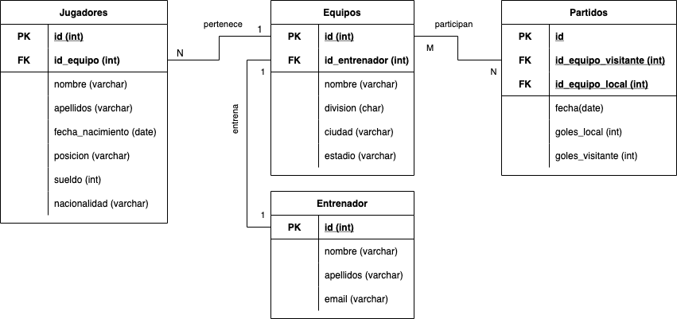

# Ejercicio 1 

Ejercicio de DDL en el que hay que modelar la siguiente base de datos:




## 1. Crear las tablas 

Según el esquema anterior, sería necesario crear las siguientes tablas:
- [Jugadores](#tabla-jugadores)
- [Equipos](#tabla-equipos)
- [Entrenador](#tabla-entrenador)
- [Partidos](#tabla-partidos)


### Tabla Jugadores 
La tabla jugadores tiene los siguientes campos
Crear la tabla jugadores:

SQL
`CREATE TABLE Jugadores (
    id INT NOT NULL AUTO_INCREMENT PRIMARY KEY, 
    id_equipo INT, 
    nombre VARCHAR (20) NOT NULL, 
    apellidos VARCHAR (20) NOT NULL, 
    fecha_Nacimiento DATE NOT NULL,
    posicion VARCHAR (20) NOT NULL, 
    sueldo INT NOT NULL,
    nacionalidad VARCHAR (20) NOT NULL
);
´´
### Tabla Equipos 
Crear la tabla equipos:

```SQL
CREATE TABLE Equipos (
    id INT NOT NULL AUTO_INCREMENT PRIMARY KEY, 
    id_entreador INT, 
    nombre VARCHAR (20) NOT NULL, 
    division CHAR NOT NULL, 
    ciudad VARCHAR (20) NOT NULL, 
    estado VARCHAR (20) NOT NULL
);
```
### Tabla Entrenador 
//Ejercicio 3 Crear tabla Jugadores y despues añadir la clave foraneas

```SQL
CREATE TABLE Entrenador (
    id INT NOT NULL AUTO_INCREMENT PRIMARY KEY, 
    nombre VARCHAR (20) NOT NULL, 
    apellidos VARCHAR (30) NOT NULL, 
    email VARCHAR (30) NOT NULL
);
```

### Tabla Partidos 
//Ejercicio 4 Crear tabla Jugadores y despues añadir la clave foraneas
```SQL
CREATE TABLE Partidos (
    id INT NOT NULL AUTO_INCREMENT PRIMARY KEY, 
    id_equipo_visitante INT , 
    id_equipo_local INT, 
    fecha DATE NOT NULL, 
    goles_local INT NOT NULL, 
    goles_visitante INT NOT NULL
);
```
## 2. Añadir las claves foráneas

Una vez creadas las tablas, es necesario relacionarlas a través de las claves foráneas. Para ello, es necesario...

ALTER TABLE Jugadores ADD FOREIGN KEY(id_equipo) REFERENCES Equipos (id);

ALTER TABLE Equipos ADD FOREIGN KEY(id_entreador) REFERENCES Entrenador(id);

ALTER TABLE Partidos ADD FOREIGN KEY(id_equipo_local) REFERENCES Equipos(id);
ALTER TABLE Partidos ADD FOREIGN KEY(id_equipo_visitante) REFERENCES Equipos(id);

